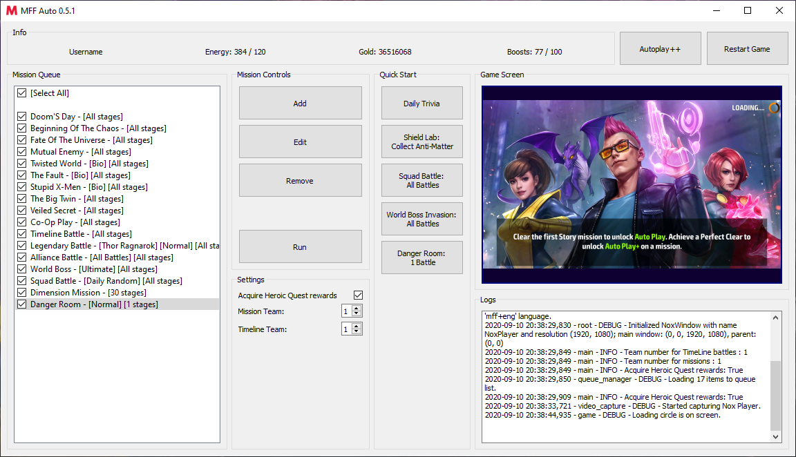

# mff_auto
Game bot for [Marvel Future Fight](https://play.google.com/store/apps/details?id=com.netmarble.mherosgb&hl=ru) game.
Compatible with **6.4.1** version.

## FAQ
**Q**: What this bot can do?

**A**: **mff_auto** can play almost all game modes: World Bosses, Alliance Battle, Co-op missions, Dimension missions, Timeline battles, Legendary battles, World Boss Invasions, Epic Quests, Danger Room.

Also it can enable *Autoplay++* feature anywhere and do your daily routines.

**Q**: Which Android emulators are supported?

**A**: [NoxPlayer](https://bignox.com) and [BlueStacks](https://www.bluestacks.com).

**Q**: Why are you suggesting to use **NoxPlayer**?

**A**: NoxPlayer has shortcut to force close applications (requires to reset game's state).
 **Shifter's biometric farming is available only using NoxPlayer!**

## Video example

Video footage of all game modes running by **mff_auto**: https://youtu.be/QcgZcAwBL-I

## Installation

- Install [NoxPlayer](https://bignox.com) (or [BlueStacks](https://www.bluestacks.com))
 and then install and run [Marvel Future Fight](https://play.google.com/store/apps/details?id=com.netmarble.mherosgb).

- Set [NoxPlayer](http://res06.bignox.com/full/20190723/7806c680dd1e4a66990aea06b6dcbcc9.exe?filename=nox_setup_v6.3.0.5_full_intl.exe)
 (or [BlueStacks](https://www.bluestacks.com))
 screen resolution at least **1280x720**. If you encounter problems then try **1920x1080**.
 
- Set in [Marvel Future Fight](https://play.google.com/store/apps/details?id=com.netmarble.mherosgb) setting **GRAPHICS** to at least **Medium**. Lesser settings will lead to blurried text.

  In the same setting's menu turn off this notifications: `Mission Navigation Auto Popup` and `Future Pass Point Acquired`.

- Download last release: [Link to releases](https://github.com/tmarenko/mff_auto/releases)

- Run `start.bat`

## Usage

### Setup window

On first start you will see `Setup` window. Follow the instructions in the window:
- You need to select one of opened emulators. Name of the emulator will be stored in `settings/gui/game.json`.

  You can change it manually after or delete `settings/gui/game.json` if you want to run `Setup` again.

- **(Only for NoxPlayer)** Then you will be asked questions. Read instructions and select `Yes` or `No`.

  At the end you will be asked to click at **MFF** app in the window. Position of app icon will be stored in `settings/gui/game.json`.
 
  You need to **restart NoxPlayer** and **mff_auto** to apply changes.

  This will allow **mff_auto** to close and start the game.
  
### Main window



- `Game screen` shows you game's image at 6-7 fps.

- `Missions Queue` allows you to add, edit or remove available missions in **mff_auto**.

  `Run` button will run all checked missions from top to bottom.
  
- `Setting` allows you to edit available settings.

- `Quick Start` allows you to quick run a few modes without adding them to mission queue.

- `Autoplay++` enables casting skills in the battles (also skips cutscenes).

- `Debug Log` at bottom shows you messages about current running code.

  You can also check it in `logs\debug.log` file.

## Development

At current state Marvel Future Fight bot is at beta stage.

- Timeline battle do not check if your team is available for battle. Please setup team manually.
- Alliance and World Boss battles do not check if your characters can do these modes. Make sure that you have strong characters.

## Contribution

Feel free to contribute. Don't forget about [license](LICENSE).

### Running from source code

- Install [Python 3.6.5](https://www.python.org/downloads/release/python-365)
- Install [Tesseract OCR 3.05.02](https://digi.bib.uni-mannheim.de/tesseract) and add path to Tesseract to your `PATH` environment.
- Download source code and install all requirements: ```pip install -r requirements.txt```
- Copy `tessdata` folder to your Tesseract folder.
- Add `lib` folder to your `PYTHONPATH` or mark it as lib source.

Check `example.py` for examples of running any modes.

### Capture video for debugging

```python
    from lib.players.nox_player import NoxWindow
    from lib.game.game import Game
    from lib.video_capture import NoxCapture
    
    nox = NoxWindow("NoxPlayer")
    game = Game(nox)
    with NoxCapture(nox) as nox_recorder:
        # video file is in `logs` folder
        nox_recorder.pause()
        # pause recording
        nox_recorder.resume()
```

### Building release package from source code

- Run `build.py`
